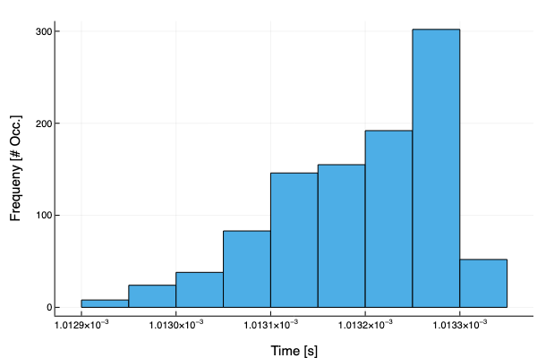

# Chen System
*<p style="text-align: center;">October 28, 2021</p>*

## Summary
The objective of this research project was **to design a controller and state-observer to render an unstable equilibrium point of the unforced chaotic system -- namely the Chen system -- attractive**.

This research was carried out with and directed by [Dr. Christopher Nielsen](https://ece.uwaterloo.ca/~cnielsen/) at the University of Waterloo as part of an Undergradaute Research Assistantship (URA) in 2021. 

### Demo

## Background
The [Chen System](https://www.sciencedirect.com/science/article/abs/pii/S096007790100251X) is a chaotic dynamical system governed by the following equations:

$$
\dot{x}_1 = a (x_2 - x_1)
$$

$$
\dot{x}_2 = (c-a) x_1 + c x_2 + x_1 x_3 + u
$$

$$
\dot{x}_3 = -b x_3 + x_1 x_2
$$

The theory undergirding chaotic systems in general and this system in particular is pretty complicated, so I recommend reading Chen's paper for more background. But we can best understand this system as the dual of the Lorenz Attractor.


### Chaos & Ergodicity
A chaotic system is any system with the property that small changes to the initial conditions $x(0) \in \mathbb{R}^n$ result in large changes in the system's trajectory. 

A dynamical system's trajectory is the solution of state-variables parametrized by time. So in this case, the state-variables are $x_1$, $x_2$, and $x_3$. 

## Results

## Conclusion

### References

----

ttraction Table](plots_tables/Verify_Domain_of_Attraction_Table.png)
- the table above is consistent with the table in the notes.
  - to replicate results, run jl/VerifyDomainAttraction.jl
  - the 'K' vector was initially seeded with the values from the table in the notes, but was subsequently modified with values from 7-500 to redraw the graphs
  - the 'P' matrix was obtained by running src/domain_of_attraction.m to determine the dependence of the 'A' matrix on the 'P' matrix. Then a third matrix representing that relationship was inverted to satisfy ```PA + A'P=-I```.


- the figure above is consistent with the major axis plot from the notes.


- the figure above is consistent with the minor axis plot from the notes.

--------------------------------------------------------------------------------
Closed-Loop No Observer
-----------------------
- in this section, simulation results from the closed-loop Chen system are discussed.
- the system doesn't make use of a state-observer. Instead, the actual state of the system (as opposed to an approximation thereof) is used to determine whether the controller should turn on.
- Data were obtained by simulating the system 1000 times with varying initial conditions. With each simulation, the time it took for the controller to turn on (i.e. the time for the state of the system to get arbitrarily close to the equilibrium state) was measured.


- the table above depicts summary statistics of the amount of time that it takes for the Chen system controller to turn on.


- the figure above depicts a histogram of simulation data.


--------------------------------------------------------------------------------
Closed-Loop Observer
--------------------
- in this section, simulation results from the closed-loop Chen system are discussed.
- the system makes use of a state-observer, which approximates the state of system from the inputs and (measured) outputs. After sufficient time has passed that the approximated state has converged to the actual state, the controller waits until the approximated state gets arbitrarily close to the equilibrium point to turn on.
- Data were obtained by simulating the system 1000 times with varying initial conditions. With each simulation, the time it took for the controller to turn on (i.e. the time for the approximated state of the system to first converge to the actual state, then to get arbitrarily close to the equilibrium state) was measured.


$\textbf{Statistic}$


- the table above depicts a histogram of simulation data.


- the table above depicts summary statistics of the amount of time that it takes for the Chen system controller to turn on with the state-observer offset by tmin


- the table above depicts a histogram of simulation data offset by tmin

--------------------------------------------------------------------------------
Notes
-----
- I could be interpreting the meaning of ```tmin``` incorrectly, but I expected the offset observer statistics to more closely resemble the statistics with no observer. That is, I expected that after having subtracted the minimum amount of time we would expect for there to be convergence of the approximated state to the actual state from each of the data points, that the general trend of the data (min, max, mean, median, but not necessarily shape) would be almost exactly like when we were just observing the state of the system directly. But that is not the case. It's possible this results from a bug in the code, or perhaps there is a theoretical explanation. I don't know.
- Another thing to look into would be the effect of β on the time to convergence.
