# Delta Robot Control (2/2)
*<p style="text-align: center;">October 27, 2021</p>*

[](https://hits.seeyoufarm.com)

## Summary
I derive a robust motion control law for delta robots to track B-Spline reference trajectories subject to model uncertainty and sensor noise.

This post expands upon a [previous post](./delta-robot-modeling.html) on the modeling of delta robots.

All the source code is available on [github](https://github.com/zborffs/Delta).

### Demo
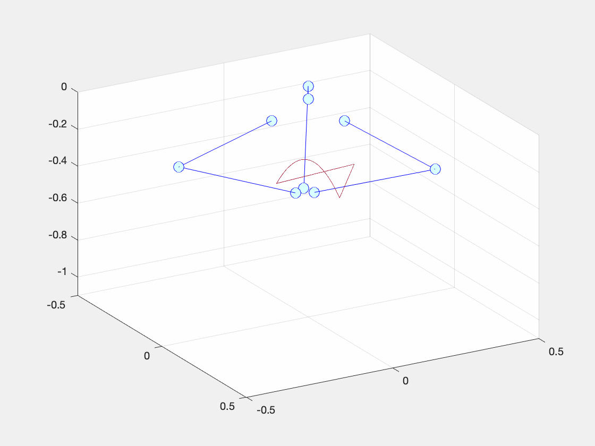
*<p style="text-align: center;">Figure 1: Animation of solution to system of DAEs representing the dynamics of a delta robot with feedforward PID motion controller moving end-effector along B-Spline reference trajectory</p>*
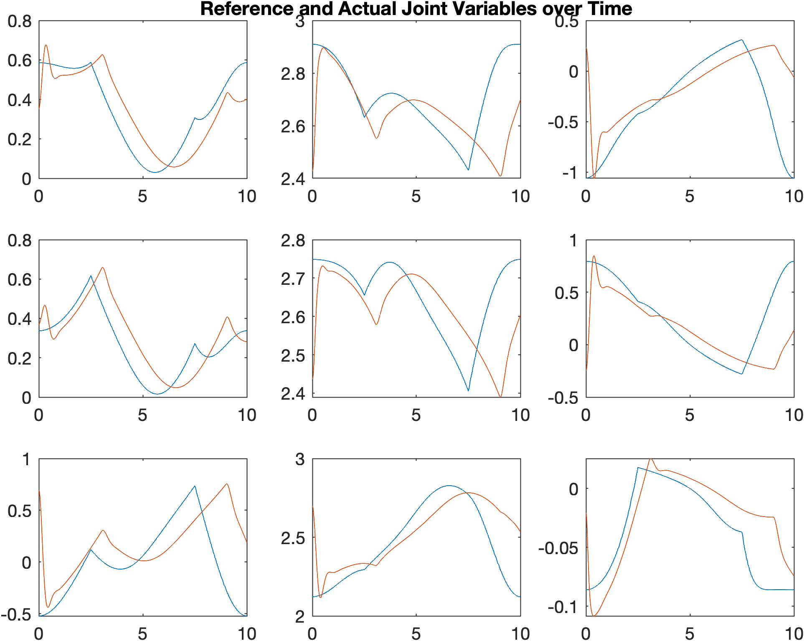
*<p style="text-align: center;">Figure 2: Plots of error signals for each joint variable corresponding to the simulation in Figure 1.</p>*

## Feedforward PID Motion Control
One of the most common control schemes for the motion control of robotic manipulators is feed-forward PID control.

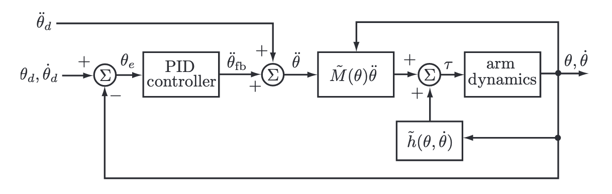
*<p style="text-align: center;">Figure 3: Feedforward PID Motion Control Topology. Source, Modern Robotics [<a href="#mr">1</a>].</p>*

The general approach is to cancel out the nonlinearities of the model (i.e. the mass, coriolis, and gravity matrices), and then enforce second-order error dynamics by "feeding forward" reference displacements, velocities, and accelerations within a basic PID setup. Designing such a controller to meet transient and steady-state specifications then becomes trivial assuming that one has a somewhat accurate model.

However, designing such a controller for delta robots has an additional complication, namely: how one should handle the constraint term with the Lagrange multipliers.

Recall the model of the robot: 
$$
M(q) \ddot{q} + C(q,\dot{q}) + G(q) = H^{T}(q) \lambda + D \dot{q} + B u \tag{1}
$$

$$
h(q) = \begin{bmatrix} x_{13} - R_z(2\pi / 3) x_{23} \\\ x_{13} - R_z(-2\pi / 3) x_{33} \end{bmatrix} = 0 \in \mathbb{R}^{6 \times 1}  \tag{2}
$$

where $M \in \mathbb{R}^{9 \times 9}$, $C \in \mathbb{R}^{9 \times 1}$, $G \in \mathbb{R}^{9 \times 1}$, $H(q) = \dot{h}(q(t)) \in \mathbb{R}^{6 \times 9}$, $\lambda \in \mathbb{R}^{6 \times 1}$, $D \in \mathbb{R}^{9 \times 1}$, $B \in \mathbb{R}^{9 \times 3}$, and $u \in \mathbb{R}^{3 \times 1}$.

Within the feedforward PID framework, there is no way of handling the constraint term $H^{T}(q) \lambda$. Therefore, we have to devise a method of only producing control inputs $u$ respecting the constraint. That way, we can ignore the constraint term completely, and treat this as any other feedforward PID motion control design problem. This process is done through what is referred to as a ***projection matrix***, $P$.

To derive $P$, let us first rearrange the equations:

$$
Bu = \tau = M(q) \ddot{q} + C(q, \dot{q}) + H^T(q)  \tag{3}
$$

$$
\dot{h}(t) = \nabla_q h \dot{q} = H(q) \dot{q} = 0 \tag{4}
$$

where $\lambda$ is a set of Lagrange multipliers and $H^T(q) \lambda$ are joint forces **acting against the constraints**. Note: $\lambda$ has absorbed a negative sign much like constants of integration. The controller has access to the state variables, $q$ and $\dot{q}$, but it doesn't have access to the values of $\lambda$. We can't solve for $\lambda$ by solving the DAE, because the solution to the DAE is also a function of the control input, which we are trying to determine. This motivates finding an expression for $\lambda$ in terms of the other state variables.

Much like Baumgarte reduction, we take the time derivative of the constraint to yield a new equation involving accelerations and rearrange as follows:

$$
\dot{H}(q) \dot{q} + H(q) \ddot{q} = 0
$$

$$
H(q) \ddot{q} = -\dot{H}(q) \dot{q} \tag{5}
$$

We substitute the above equation into a rearranged form of $(3)$ to get an equation for $\lambda$:

$$
\lambda = (H M^{-1} H^{T})^{-1}(H M^{-1}(\tau - C - G) - H\ddot{q}) \tag{6}
$$

Substituting this expression in for the original system yields:

$$
P \tau = P(M\ddot{q} + C + G) \tag{7}
$$

where

$$
P = I - H^T(H M^{-1} H^{-1})^{-1}H M^{-1} \in \mathbb{R}^{9 \times 9} \tag{8}
$$

The projection matrix is of rank $n-k=9-6=3$ and maps the joint torques $\tau$ to $P(q)\tau$, projecting away the generalized force components acting on the constraints while retaining the generalized forces that do work on the robot. The complementary projection $I-P(q)$ maps $\tau$ to $(I-P(q))\tau$, the joint forces that act on the constraints and do no work on the robot.

Now we have a model for the part of the system that we are allowed to control. If we ignore $P$ for now, we are left with a familar model:

$$
\tau = Bu = M(q) \ddot{q} + C(q, \dot{q}) + G(q)
$$

However, we cannot directly dictate the positions of every joint variable; we can only actuate the top joint of each arm. Correspondingly, $B$ is not invertible, because $B \in \mathbb{R}^{9 \times 3}$. Ideally, the system would be fully-actuated, enabling us to simply write:

$$
u = M(q) (\ddot{r} + K_p (r - q) + K_d (\dot{r} - \dot{q}) + K_i \int(r - q)d\tau) + C(q, \dot{q}) + G(q)
$$

which, when substituted into the constrained system, would yield 2nd order error dynamics as follows:

$$
\ddot{q} = \ddot{r} + K_p (r - q) + K_d (\dot{r} - \dot{q}) + K_i \int(r - q)d\tau
$$

$$
\ddot{e} + K_d \dot{e} + K_p e + K_i \int e d\tau = 0
$$

But because $B$ is not invertible, we cannot do this.


However, since the system has three velocity freedoms, we can take the [pseudo-inverse](https://en.wikipedia.org/wiki/Moore%E2%80%93Penrose_inverse) of $B$ and control the position of the 3 revolute joints to control the full robot.

The corresponding control law is:

$$
u = P B^{+} (M(q) (\ddot{r} + K_p (r - q) + K_d (\dot{r} - \dot{q}) + K_i \int(r - q)d\tau) + C(q, \dot{q}) + G(q)) 
$$

### Closed-Loop, Motion-Controlled Robot Animation
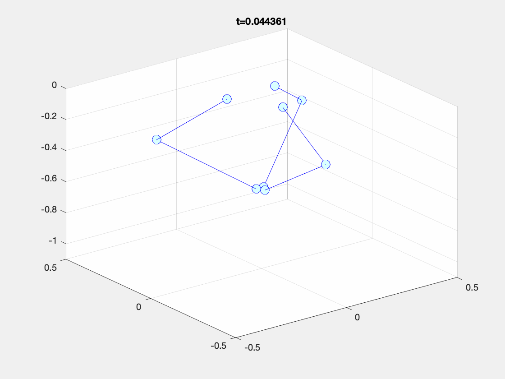
*<p style="text-align: center;">Figure 4: Animation of solution to system of DAEs with feedforward PID motion controller moving end-effector to the home position.</p>*
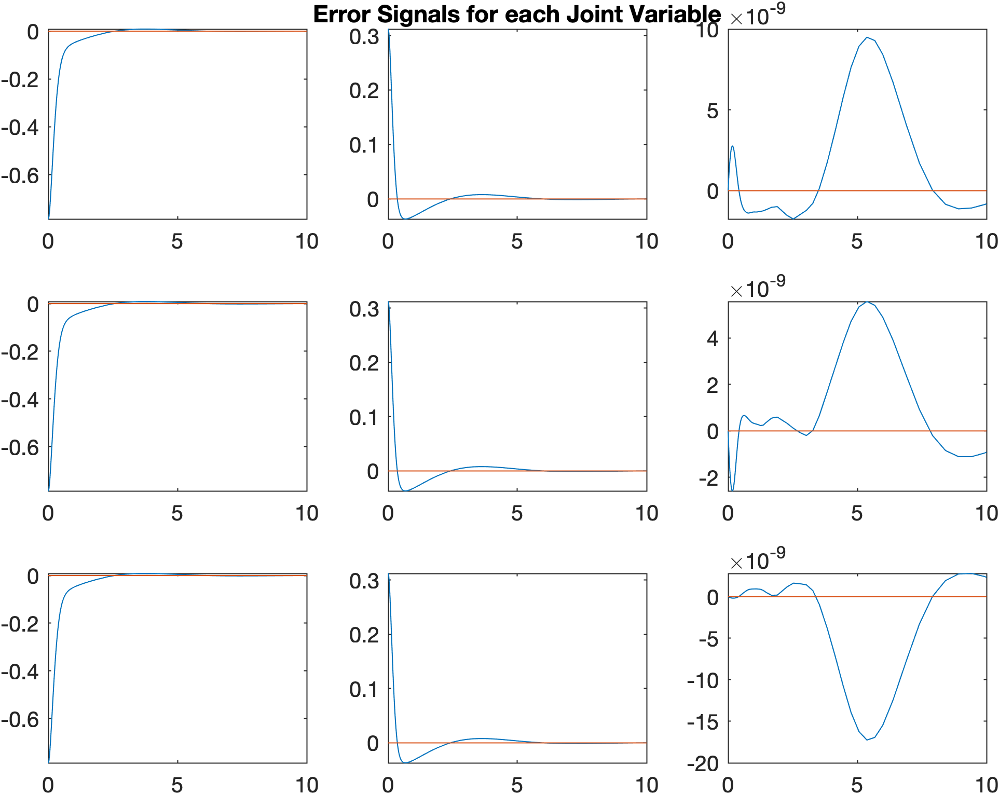
*<p style="text-align: center;">Figure 5: Plots of error signal of each joint variable exhibiting 0 steady-state error and a 2nd order transient response.</p>*

## B-Splines
One popular class of reference trajectories is [B-Splines](https://en.wikipedia.org/wiki/B-spline). There are manifold benefits to using B-Splines, though they come at the cost of complexity.

B-Splines (short for basis splines) can be thought of as regular spline functions composed of linear combinations of B-Spline basis functions. If the basis is chosen appropriately, then representing the spline in this fashion can massively improve the computational efficiency of calculating a trajectory. 

Additionally, using B-Splines enables us to trivially compute the displacement, velocity, and acceleration of the end-effector analytically to be fed-forward to our control algorithm. 

### Example Reference Trajectory
Before we can compute a trajectory, we need to choose via-points for the end-effector to move through at specified times.

The following `Julia` snippet generates a time vector and a via-point vector, and subsequnetly plots them.

```julia
using Plots # plotting library

t = [0, 1, 2, 3, 4]; # time vector
points = [0 0 0; 0 0.5 -2; 1 1 0; 2 1.5 -2; 0 0 0]; # via-points

# Extract (x,y,z) coordinates
x = points[:,1]
y = points[:,2]
z = points[:,3]

# Plot
p1 = plot(t,x, label="x"); scatter!(t,x, label=:none);
p2 = plot(t,y, label="y", linecolor=:green); scatter!(t,y, label=:none);
p3 = plot(t,z, label="z", linecolor=:purple); scatter!(t,z, label="Via Points");
plt = plot(p1, p2, p3, layout=(3,1), legend=:outertopright);
p4 = plot3d(x,y,z, xlabel="x", ylabel="y", zlabel="z", label=:none); scatter3d!(x,y,z, markersize=2, label=:none)
plt2 = plot(plt, p4, layout=(1,2))
```
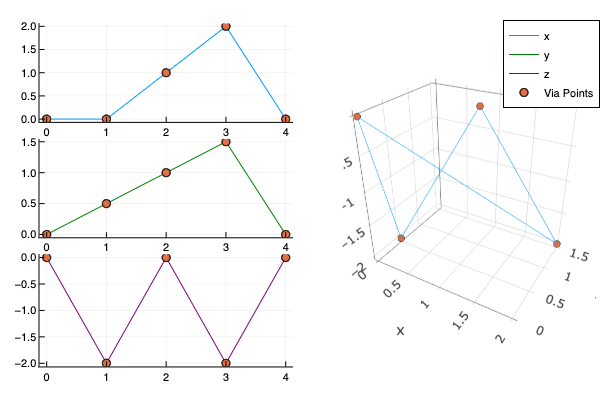
*<p style="text-align: center;">Figure 6: Plots of the via-points and the linear interpolations between the via points projected onto the YZ, XZ, and XY planes respectively as well as a 3D representation.</p>*


By making use of `BSplines.jl`, we can quickly compute an average basis to pass through each of the via-points. Also notice how, in the following snippet, the basis function is represented by an order and a knot vector and the spline is represented (in part) as a coefficients vector. 

```julia
using BSplines

# Generate the average B-Spline Basis Functions
basis = averagebasis(4,t)
# > 5-element BSplineBasis{Array{Float64,1}}:
# >  order: 4
# >  breakpoints: [0.0, 2.0 4.0]

# Compute the displacement splines
xspline = BSplines.interpolate(basis, t, x)
# > Spline{BSplineBasis{Array{Float64,1}},Array{Float64,1}}:
# >  basis: 5-element BSplineBasis{Array{Float64,1}}:
# >   order: 4
# >   breakpoints: [0.0, 2.0, 4.0]
# >  coeffs: [0.0, -0.444444, 0.666667, 3.11111, 0.0]
yspline = BSplines.interpolate(basis, t, y)
zspline = BSplines.interpolate(basis, t, z)

# Approximate the splines by sampling them 100 times so that we can plot them
xapprox = xspline.(range(0, 5.0; length=100))
yapprox = yspline.(range(0.0, 5.0; length=100))
zapprox = zspline.(range(0.0, 5.0; length=100))

# Plot Trajectories
p1 = plot(xspline, label="x"); scatter!(t,x, label=:none)
p2 = plot(yspline, label="y", linecolor=:green); scatter!(t,y, label=:none)
p3 = plot(zspline, label="z", linecolor=:purple); scatter!(t,z, label="Via Points")
plt = plot(p1, p2, p3, layout=(3,1), legend=:outertopright)
p4 = plot3d(xapprox, yapprox, zapprox, xlabel="x", ylabel="y", zlabel="z", label=:none); scatter3d!(x,y,z, markersize=2, label=:none)
plt2 = plot(plt, p4, layout=(1,2))

# Plot Basis Functions
plot(basis, legend=:none, title="Trajectory Basis Functions")
```

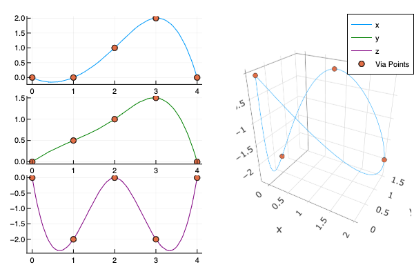
*<p style="text-align: center;">Figure 7: Plots of the via-points and the B-Spline trajectories (using average basis) between the via points projected onto the YZ, XZ, and XY planes respectively as well as a 3D representation.</p>*

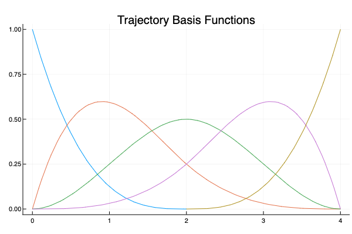
*<p style="text-align: center;">Figure 8: Plot of B-Spline basis functions used for computing the trajectory in Figure 7.</p>*

If we sought to generate a path which would force the end-effector to temporarily stop mid-trajectory -- in order to pick something up or put something down, for example -- then we would simply pick a knot vector with repeated knot points at the locations we want to stop.

```julia
# stop at time 1 and time 3
basis = BSplines.BSplineBasis(4, [0.0, 1.0, 1.0, 2.0, 3.0, 3.0, 4.0])
```

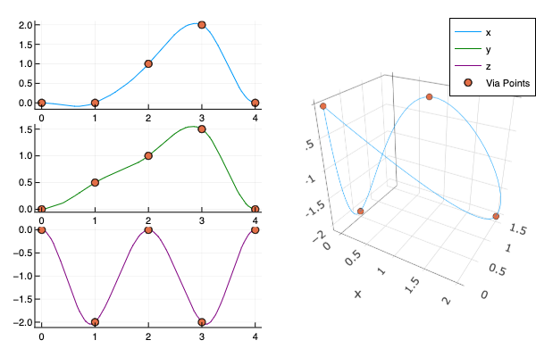
*<p style="text-align: center;">Figure 9: Plots of the via-points and the B-Spline trajectories (using repeated basis) between the via points projected onto the YZ, XZ, and XY planes respectively as well as a 3D representation.</p>*

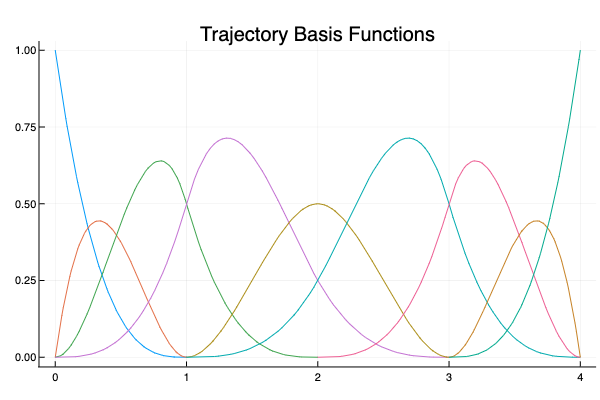
*<p style="text-align: center;">Figure 10: Plot of B-Spline basis functions used for computing the trajectory in Figure 9.</p>*

By making use of the inverse kinematics algorithm from the previous article, we can transform the end-effector displacement, velocity, and acceleration vectors into such vectors for the 9 state variables. These reference trajectories can then be fed into our control algorithm.

The following animation depicts the robot perfectly tracking the trajectory from Figure 7 after having converted the end-effector trajectory into state variable trajectories via the inverse kinematics algorithm.

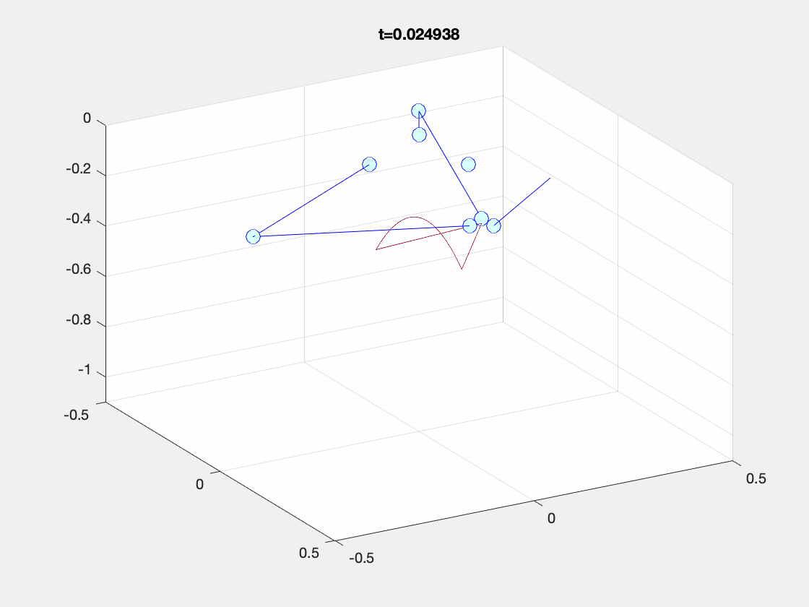
*<p style="text-align: center;">Figure 11: Delta Robot perfectly tracking the B-Spline trajectory from Figure 7.</p>*

## Robustness
The control law that we have derived makes use of knowledge of system parameters to compute output torques and, our simulations assume that we can perfectly capture the full-state of the system from the sensors without any additive noise. If this controller is to be at all useful for real-world applications, it will need to be robust both to model uncertainty -- that is slightly different model parameters than those the system actually exhibits -- and exogenous disturbances -- that is additive noise or vibrations causing the joints or links in actuality or their sensor measurements to deviate slightly from the controller's predictions.

In this section, we will test whether the controller is robust *in simulacra* by slightly modifying the controller's internal model parameters while simultaneously injecting additive white Gaussian noise to various state variables to simulate sensor noise. 

If controller can still reasonably track reference trajectories and return to the home position despite these factors, then we can be marginally more certain in the robustness of the controller. To test this more rigorously, this controller should be deployed to an actual robot and tested similarly.

### Model Uncertainty and Exogenous Disturbances
We can integrate model uncertainty into our control law by introducing estimates of the system parameters. An estimated model parameter is indicated with a tilde over the variable ($\widetilde{X}$):

$$
u = \widetilde{P} {B}^{+} (\widetilde{M}(q) (\ddot{r} + K_p (r - q) + K_d (\dot{r} - \dot{q}) + K_i \int(r - q)d\tau) + \widetilde{C}(q, \dot{q}) + \widetilde{G}(q)) 
$$

In simulation, we add white Gaussian noise with $0$ mean and unit variance ($\mathcal{N}(0,1)$) to the controller's estimation of the mass of each link and of the end-effector. To model exogenous disturbances, we add white Gaussian noise with $0$ mean and $10^{-9}$ variance ($\mathcal{N}(0,10^{-9})$) to the controller's estimation of the state variables $q$ and $\dot{q}$.

The following results demonstrate the controller's performance despite these perturbations.


*<p style="text-align: center;">Figure 12: Animation of solution to system of DAEs representing the dynamics of a delta robot with feedforward PID motion controller moving end-effector to home position despite sensor noise and model uncertainty.</p>*

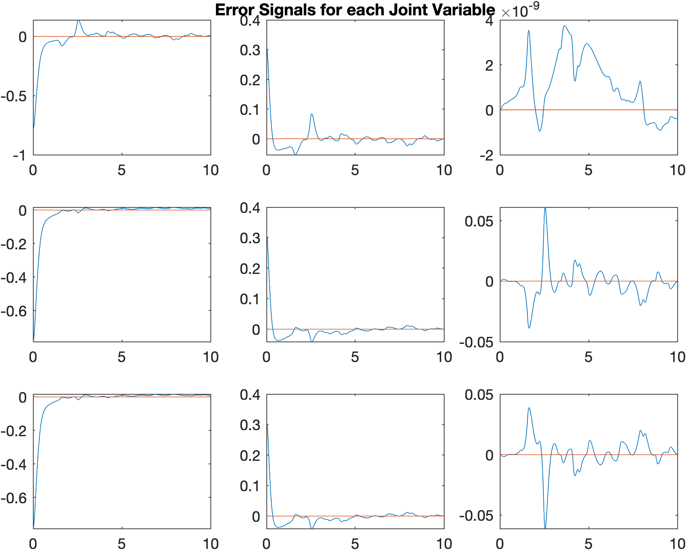
*<p style="text-align: center;">Figure 13: Plots of error signals for each joint variable corresponding to the simulation in Figure 12.</p>*

## Conclusion
In this article, I derived a robust feedforward PID motion controller for delta robots to track B-Spline reference trajectories in the presence of sensor noise and subject to model uncertainty. The controller's performs reasonably well, but not perfectly -- especially when the controller encounters some kind of discontinuity in the displacement, velocity, or acceleration reference signals. 


### References
[1] Kevin M. Lynch, Frank C. Park. Modern Robotics: Mechanics, Planning, and Control. Cambridge University Press. May 3, 2017. <p id="mr"> </a>