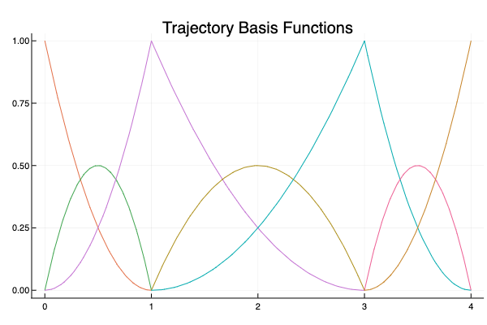
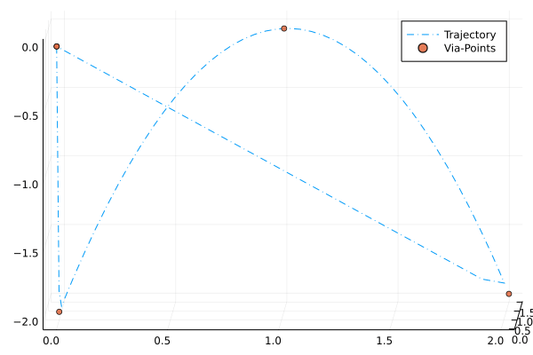

# Delta Robot Control (2/2)
*
October 27, 2021
*

## Summary
I derive both robust analog and digital motion control laws for delta robots to track B-Spline reference trajectories subject to model uncertainty and sensor noise.

This post expands upon a [previous post](./delta-robot-modeling.html) on the modeling of delta robots.

All the source code is available on [github](https://github.com/zborffs/Delta).

### Demo

*
Figure 1: Animation of solution to system of DAEs feedforward PID motion controller moving end-effector along B-Spline reference trajectory
*

*
Figure 2: Plots of error signal of each joint variable.
*

## Feedforward PID Motion Control
One of the most common control schemes for the motion control of robotic manipulators is feed-forward PID control.

*
Figure 3: Source, Modern Robotics [<a href="#mr">1</a>].
*

The general approach is to cancel out the nonlinearities of the model (i.e. the mass, coriolis, and gravity matrices), and then enforce second-order error dynamics with a basic PID setup. Designing such a controller to meet transient and steady-state specifications then becomes trivial assuming that one has a somewhat accurate model.

However, designing such a controller for delta robots has an additional complication, namely: how should one handle the constraint term with the Lagrange multipliers.

Recall the model of the robot: 
$$
M(q) \ddot{q} + C(q,\dot{q}) + G(q) = H^{T}(q) \lambda + D \dot{q} + B u
$$

$$
h(q) = \begin{bmatrix} x_{13} - R_z(2\pi / 3) x_{23} \\\ x_{13} - R_z(-2\pi / 3) x_{33} \end{bmatrix} = 0 \in \mathbb{R}^{6 \times 1}
$$

where $M \in \mathbb{R}^{9 \times 9}$, $C \in \mathbb{R}^{9 \times 1}$, $G \in \mathbb{R}^{9 \times 1}$, $H(q) = \dot{h}(q(t)) \in \mathbb{R}^{6 \times 9}$, $\lambda \in \mathbb{R}^{6 \times 1}$, $D \in \mathbb{R}^{9 \times 1}$, $B \in \mathbb{R}^{9 \times 3}$, and $u \in \mathbb{R}^{3 \times 1}$.

Within the feedforward PID framework, there is no way of handling the constraint term $H^{T}(q) \lambda$. Therefore, we have to devise a method of only producing control inputs $u$ respecting the constraint. That way, we can ignore the constraint term completely, and treat this as any other feedforward PID motion control design problem. This process is done through what is referred to as a ***projection matrix***, $P$.

To derive $P$, let us first rearrange the equations:

$$
Bu = \tau = M(q) \ddot{q} + C(q, \dot{q}) + H^T(q)
$$

$$
H(q) \dot{q} = 0
$$

where $\lambda$ is a set of Lagrange multipliers and $H^T(q) \lambda$ are joint forces **acting against the constraints**. Note: $\lambda$ has absorbed a negative sign much like constants of integration. The controller has access to the state variables, $q$ and $\dot{q}$, and we can't solve for $\lambda$ by solving the DAE, because the solution to the DAE is also a function of the control input, which we are trying to determine. This motivates seeking to find an expression for $\lambda$ in terms of the other state variables.

Much like Baumgarte reduction, we take the time derivative of the constraint to yield a new equation involving accelerations and rearrange as follows:

$$
\dot{H}(q) \dot{q} + H(q) \ddot{q} = 0
$$

$$
H(q) \ddot{q} = -\dot{H}(q) \dot{q}
$$

We substitute the above equation into a rearranged form of the system of differential equations to get an equation for $\lambda$:

$$
\lambda = (H M^{-1} H^{T})^{-1}(H M^{-1}(\tau - C - G) - H\ddot{q})
$$

Substituting this expression in for the original system yields:

$$
P \tau = P(M\ddot{q} + C + G)
$$

where

$$
P = I - H^T(H M^{-1} H^{-1})^{-1}H M^{-1} \in \mathbb{R}^{9 \times 9}
$$

The projection matrix is of rank $n-k=9-6=3$ and maps the joint torques $\tau$ to $P(q)\tau$, projecting away the generalized force components acting on the constraints while retaining the generalized forces that do work on the robot. The complementary projection $I-P(q)$ maps $\tau$ to $(I-P(q))\tau$, the joint forces that act on the constraints and do no work on the robot.

Now we have a model for the part of the system that we are allowed to control. If we ignore $P$ for now, we are left with a familar model:

$$
\tau = Bu = M(q) \ddot{q} + C(q, \dot{q}) + G(q)
$$

However, we cannot directly dictate the positions of every joint variable; we can only actuate the top joint of each arm. Correspondingly, $B$ is not invertible, because it is $B \in \mathbb{R}^{9 \times 3}$. Ideally, the system would be fully-actuated, enabling us to simply write:

$$
u = M(q) (\ddot{r} + K_p (r - q) + K_d (\dot{r} - \dot{q}) + K_i \int(r - q)d\tau) + C(q, \dot{q}) + G(q)
$$

which, when substituted into the constrained system, would yield 2nd order error dynamics as follows:

$$
\ddot{q} = \ddot{r} + K_p (r - q) + K_d (\dot{r} - \dot{q}) + K_i \int(r - q)d\tau
$$

$$
\ddot{e} + K_d \dot{e} + K_p e + \int e d\tau = 0
$$

But because $B$ is not invertible, we cannot do this. However, since the system has $3$ degrees of freedom in the choice of revolute joint variables, we can take the pseudo-inverse of $B$ and control the position of the 3 revolute joints to control the full robot.

The corresponding control law is:

$$
u = P B^{+} (M(q) (\ddot{r} + K_p (r - q) + K_d (\dot{r} - \dot{q}) + K_i \int(r - q)d\tau) + C(q, \dot{q}) + G(q))
$$

### Closed-Loop, Motion-Controlled Robot Animation

*
Figure 3: Animation of solution to system of DAEs with feedforward PID motion controller moving end-effector to the home position.
*

*
Figure 4: Plots of error signal of each joint variable exhibiting 0 steady-state error and a 2nd order transient response.
*

## B-Splines
One popular class of reference trajectories is [B-Splines](https://en.wikipedia.org/wiki/B-spline).

B-Splines (short for basis splines) can be thought of as regular spline functions composed of linear combinations of basis spline functions. If the basis is chosen appropriately, then representing the spline in this fashion can massively improve the computational efficiency of calculating a trajectory. 

Additionally, by making good choices for the knot points, it is possible to capture discontinuities in the reference velocity or acceleration, enabling the robot to temporarily stop mid-trajectory, while also ensuring that the end-effector doesn't leave the convex-hull of any knot-points tracing a trajectory.

These benefits come in conjunction with the other benefits of using splines, such as the fact that they provide us with closed-form expressions for the displacement, velocity, and acceleration of the end-effector, which can be fed-forward into the control algorithm for the optimal performance.

These benefits motivate writing some code to generate referece trajectories using B-Splines.

### Example Reference Trajectory

*
Figure 5: Plot of B-spline basis functions using to generate the B-Spline reference displacement, velocity, and acceleration.
*

*
Figure 6: Animation of trajectory.
*

*
Figure 7: Delta Robot perfectly tracking the B-Spline trajectory.
*

## Robustness
The control law that we have derived makes use of knowledge of system parameters to compute output torques. Moreover, our simulations assume that we can perfectly capture the full-state of the system from the sensors without any additive noise. If this controller is to be at all useful for real-world applications, it will need to be robust both to model uncertainty -- that is slightly different model parameters than those the system actually exhibits -- and exogenous disturbances -- that is additive noise or vibrations causing the joints or links in actuality or their sensor measurements to deviate slightly from the controller's predictions.

In this section, we will test whether the controller is robust *in simulacra* by slightly modifying the controller's internal model parameters while simultaneously injecting additive white Gaussian noise to various state variables to simulate sensor noise. 

If controller can still reasonably track reference trajectories and return to the home position despite these factors, then we can be marginally more certain in the robustness of the controller. To test this more rigorously, this controller should be deployed to an actual robot and tested similarly.

### Model Uncertainty

### Exogenous Disturbances

## Digitization
If this code were ever used on physical hardware, it would be necessary first to digitize the controller. In this section, I go over digitization and demonstrate how one might implement the controller in C/C++ function.

### References
[1] Kevin M. Lynch, Frank C. Park. Modern Robotics: Mechanics, Planning, and Control. Cambridge University Press. May 3, 2017. 
 </a>