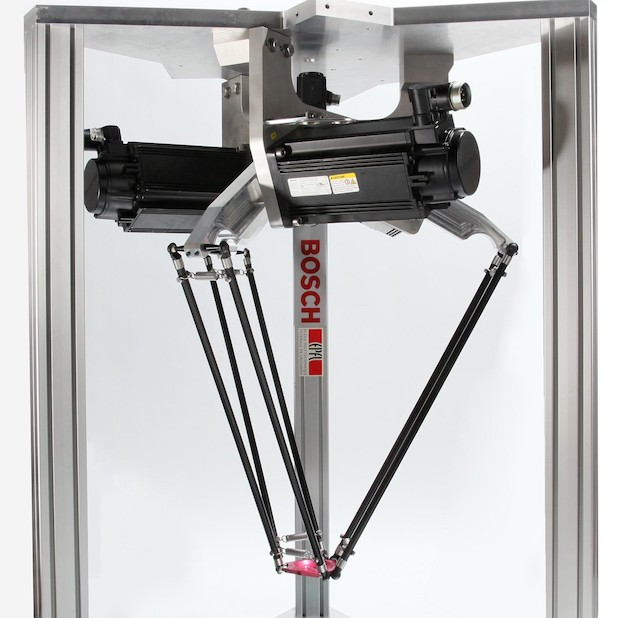
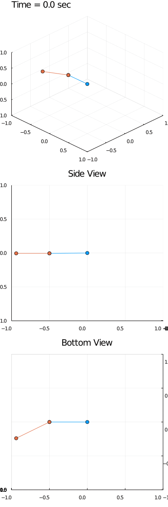

# Delta Robot Modeling (1/2)
*<p style="text-align: center;">October 26, 2021</p>*
[](https://hits.seeyoufarm.com)

## Summary
In this article, I derive the __dynamics, forward kinematics, and inverse kinematics of delta robots__.

All the source code is available on [github](https://github.com/zborffs/Delta). 

### Demo

*<p style="text-align: center;">Figure 1: Animated numerical solution to system of differential-algebraic equations (DAEs) representing the dynamics of a delta robot</p>*


## Delta Robot Description

*<p style="text-align: center;">Figure 2: Source, EPFL [<a href="#epfl">1</a>]</p>*

A delta robot is a parallel robot consisting of an immobile base, a mobile platform below the base, and 3 arms connecting the base to the platform. Each arm consists of 2 links and 2 joints - one revolute, one universal. The revolute joint connects the base to the upper link, and is actuated by a motor. The universal joint connects the upper link to the lower link, and is passive. The end of the lower link of each arm attaches to the platform, where the end-effector is mounted.

Delta robots have three degrees-of-freedom: namely, the position of the end-efffector; the orientation of the end-effector cannot be changed and is usually perpendicular to the ground, making the platform parallel to the base.

## Deriving the Dynamics
In this section, I'll derive the dynamics of the robot using [Lagrangian mechanics](https://en.wikipedia.org/wiki/Lagrangian_mechanics). In the future, I'll extend this to include [Hamiltonian mechanics](https://en.wikipedia.org/wiki/Hamiltonian_mechanics) so that symplectic solvers can be used.

### Overview of Approach
Ignore the motors for now and assume that the three arms can swing freely. The upper link of each arm is a simple pendulum and the lower link is a spherical pendulum. In this sense, each arm is a double pendulum. The robot as a whole can be modeled as a composite of three of these double pendula offset by 120 degrees around the z-axis subject to a holonomic constraint forcing the positions of the ends of each arm to be the same.

This approach of modeling has two key benefits.

From a programming perspective, this approach is amenable to verification. Modeling simpler, well-studied systems and subsequently composing them to create more sophisticated ones lends itself well to (1) being decomposed into simple functions or objects, and (2) verifying that these sub-models are correct before creating more complex models.

From a physics perspective, this approach is simple. The holonomic constraint takes care of the complex dynamics arising from the interaction between the three arms, freeing us from having to come up with such dynamics from first principles. This offloads complexity from the dynamics onto the DAE solver, but insofar as that enables us to get something working, that's a good trade-off.

### Single Arm
We start by modeling a single arm. As with any Lagrangian formulation, we start by ascertaining the equations for the positions of the generalized coordinates. Those generalized coordinates will correspond to the angles taken by the simple and spherical pendula.


*<p style="text-align: center;">Figure 3: Source, MERL [<a href="#merl">2</a>]</p>*

Parameters / Variables | Physical Meaning
:---------------------:|-------------------------------------------:
$l_1$                | Length of Link 1 (m)
$l_2$                | Length of Link 2 (m)
$m_1$                | Mass of Link 1 (kg)
$m_2$                | Mass of Link 2 (kg)
$m_3$                | Mass of Platform (kg)
$g$                  | Acceleration due to Gravity (m/s^2)
$\phi_1$             | Angle between horizontal and Link 1 (rad)
$\phi_2$             | Angle between horizontal and Link 2 (rad)
$\phi_3$             | Angle between $xz$ plane and Link 3 (rad)
$x_{1}$              | Position of Center of Mass of Link 1 (m)
$x_{2}$              | Position of Center of Mass of Link 2 (m)
$x_{3}$              | Position of End of Link 2 (m)

```matlab
%% Declare state-variables
syms q11 q12 q13 q11dot q12dot q13dot q11ddot q12ddot q13ddot real
syms q21 q22 q23 q21dot q22dot q23dot q21ddot q22ddot q23ddot real
syms q31 q32 q33 q31dot q32dot q33dot q31ddot q32ddot q33ddot real

%% Organize symbols into vectors
q1 = [q11; q12; q13]; % position of arm 1
q1dot = [q11dot; q12dot; q13dot]; % velocity of arm 1
q1ddot = [q11ddot; q12ddot; q13ddot]; % acceleration of arm 1
q2 = [q21; q22; q23]; % position of arm 2
q2dot = [q21dot; q22dot; q23dot]; % velocity of arm 2
q2ddot = [q21ddot; q22ddot; q23ddot]; % acceleration of arm 2
q3 = [q31; q32; q33]; % position of arm 3
q3dot = [q31dot; q32dot; q33dot]; % velocity of arm 3
q3ddot = [q31ddot; q32ddot; q33ddot]; % acceleration of arm 3
q = [q11; q12; q13; q21; q22; q23; q31; q32; q33]; % overall position
qdot = [q11dot; q12dot; q13dot; q21dot; q22dot; q23dot; q31dot; q32dot; q33dot]; % overall velocity
qddot = [q11ddot; q12ddot; q13ddot; q21ddot; q22ddot; q23ddot; q31ddot; q32ddot; q33ddot]; % overall acceleration

%% Declare Model Parameters
syms l1 l2 real % lengths of link 1 and link 2 (m)
syms m1 m2 m3 real % masses of link 1, link 2 and end-effector (kg)
syms g real % gravity (m/s^2)
syms r_base r_platform real % radius of base
lc1 = l1 / 2; % distance to center of mass along link 1 (m)
lc2 = l2 / 2; % distance to center of mass along link 2 (m)
J1 = m1 * l1^2 / 12.0; % inertia link 1 (assuming rod) -> 1/3 (12.0)
J2 = m2 * l2^2 / 12.0; % inertia link 2 (assuming rod) -> 1/3 (12.0)
```

$$
x_{1} = 
\begin{bmatrix}0\\\ \frac{l_1}{2} \cos(\phi_1)\\\ \frac{l_1}{2} \sin(\phi_1)\end{bmatrix}
$$

$$
x_{2} =
\begin{bmatrix}\frac{l_2}{2} \sin(\phi_2) \sin(\phi_3)\\\ l_1 \cos(\phi_1) + \frac{l_2}{2} \cos(\phi_2)\\\ l_1 \sin(\phi_1) + \frac{l_2}{2} \sin(\phi_2) \cos(\phi_3)\end{bmatrix}
$$

$$
x_{3} =
\begin{bmatrix}l_2 \sin(\phi_2) \sin(\phi_3)\\\ l_1 \cos(\phi_1) + l_2 \cos(\phi_2)\\\ l_1 \sin(\phi_1) + l_2 \sin(\phi_2) \cos(\phi_3)\end{bmatrix}
$$

Then take the time derivatives of the position vectors to get their velocities:
$$
\dot{x}_{1} =
\begin{bmatrix}0\\\ -\frac{l_1}{2} \sin(\phi_1) \dot{\phi}_1\\\ \frac{l_1}{2} \cos(\phi_1) \dot{\phi}_1\end{bmatrix}
$$

$$
\dot{x}_{2} =
\begin{bmatrix} \frac{l_2}{2} \cos(\phi_2) \sin(\phi_3) \dot{\phi}_2 + \frac{l_2}{2} \cos(\phi_3) \sin(\phi_2) \dot{\phi}_3\\\ -l_1 \sin(\phi_1) \dot{\phi}_1 - \frac{l_2}{2} \sin(\phi_2) \dot{\phi}_2 \\\ l_1 \cos(\phi_1) \dot{\phi}_1 - \frac{l_2}{2} \sin(\phi_2) \sin(\phi_3) \dot{\phi}_3 + \frac{l_2}{2} \cos(\phi_2) \cos(\phi_1) \dot{\phi}_2 \end{bmatrix}
$$

$$
\dot{x}_{3} =
\begin{bmatrix}l_2 \cos(\phi_2) \sin(\phi_3) \dot{\phi}_2 + l_2 \cos(\phi_3) \sin(\phi_2) \dot{\phi}_3\\\ -l_1 \cos(\phi_1) \dot{\phi}_1 - l_2 \sin(\phi_2) \dot{\phi}_2 \\\ l_1 \cos(\phi_1) \dot{\phi}_1 + l_2 \sin(\phi_2) \sin(\phi_3) \dot{\phi}_3 + l_2 \cos(\phi_2) \cos(\phi_3) \dot{\phi}_2 \end{bmatrix}
$$

From here, we derive the kinetic and potential energies
$$
T = \frac{1}{2} (m_1 \dot{x}_1^T \dot{x}_1 + m_2 \dot{x}_2^T \dot{x}_2 + \frac{1}{3} m_3 \dot{x}_3^T \dot{x}_3 + (\frac{1}{3}m_1 l_1^2) \dot{\phi}_1^2 + (\frac{1}{3}m_2 l_2^2) (\sin^2(\phi_2) \dot{\phi}_3^2 + \dot{\phi}_2^2))
$$

$$
V = -g (l_1(\frac{1}{2} m_1 + (m_2 + \frac{m_3}{3})) \sin(\phi_1) + l_2(\frac{1}{2} m_2 + \frac{m_3}{3}) \sin(\phi_2) \cos(\phi_3))
$$

The Lagrangian of a system is a scalr quantity equal to the system's kinetic energy minus its potential energy: $L = T - V$. In this case, the expression is too long to warrant typing out, but the following `MATLAB` code will symbolically generate the expressions.

```javascript
phi1 = q1(1);
phi2 = q1(2);
phi3 = q1(3);
phi1dot = q1dot(1);
phi2dot = q1dot(2);
phi3dot = q1dot(3);

% Kinematics
xc11 = [0; r_base + lc1 * cos(phi1); lc1 * sin(phi1)]; % Position of Center of Mass of Link 1 of Arm 1 in Cartesian Coordintes
xc11dot = diff(xc11, phi1) * phi1dot; % Velocity of Center of Mass of Link 1 of Arm 1 in Cartesian Coordinates
xc12 = [lc2 * sin(phi2) * sin(phi3); r_base + l1 * cos(phi1) + lc2 * cos(phi2); l1 * sin(phi1) + lc2 * sin(phi2) * cos(phi3)]; % Position of Center of Mass of Link 2 of Arm 1 in Cartesian Coordinates
xc12dot = diff(xc12, phi1) * phi1dot + diff(xc12, phi2) * phi2dot + diff(xc12, phi3) * phi3dot; % Velocity of Center of Mass of Link 2 of Arm 1 in Cartesian Coordaintes
xc13 = [l2 * sin(phi2) * sin(phi3); r_base + l1 * cos(phi1) + l2 * cos(phi2); l1 * sin(phi1) + l2 * sin(phi2) * cos(phi3)]; % Position of Center of Mass of End-Effector of Arm 1 in Cartesian Coordinates
xc13dot = diff(xc13, phi1) * phi1dot + diff(xc13, phi2) * phi2dot + diff(xc13, phi3) * phi3dot; % Velocity of Center of Mass of End-Effector of Arm 1 in Cartesian Coordinates

% Kinetic & Potential Energies of Arm 1
T1 = 1/2 * m1 * xc11dot' * xc11dot + 1/2 * m2 * xc12dot' * xc12dot + 1/6 * m3 * xc13dot' * xc13dot + 1/2 * J1 * phi1dot^2 + 1/2 * J2 * (sin(phi2)^2 * phi3dot^2 + phi2dot^2); % Kinetic
V1 = -g * ((lc1 * m1 + l1 * (m2 + m3 / 3)) * sin(phi1) + (lc2 * m2 + l2 * m3 / 3) * sin(phi2) * cos(phi3)); % Potential

% Lagrangian of Arm 1
L1 = T1 - V1;
```

Next, we transform the Lagrangian via the Euler-Lagrange equation into differential equations for the double pendulum: 

$$
\frac{d}{dt}\frac{\partial L}{\partial \dot q} - \frac{\partial L}{\partial q} = 0
$$ 

Note: $q=\begin{bmatrix}\phi_1 & \phi_2 & \phi_3\end{bmatrix}^T$ and $\dot{q}=\begin{bmatrix}\dot{\phi}_1 & \dot{\phi}_2 & \dot{\phi}_3\end{bmatrix}^T$

This yields system of three, 2nd order differential equations. By factoring out the acceleration term, we get an expression that resembles: 

$$
M(q) \ddot{q} + C(q, \dot{q}) + G(q) = 0
$$

where $M(q) \in \mathbb{R}^{3\times 3}$, $C(q, \dot{q}) \in \mathbb{R}^{3\times 1}$, and $G(q) \in \mathbb{R}^{3 \times 1}$. 

Because the inertia matrix is positive-definite, it has an inverse - though it might be ill-conditioned. This means we can manipulate the above equation to yield an equation for the acceleration, which can be used to solve for trajectories numerically:

$$
\ddot{q} = M^{-1}(q)(-C(q, \dot{q}) - G(q))
$$

### (Simple-Spherical) Double Pendulum Animation (without Damping)

*<p style="text-align: center;">Figure 4: Animated solution to system of differential equations representing dynamics of double pendulum whose upper pendulum is a simple pendulum and whose bottom pendulum is a spherical pendulum</p>*


## Complete Robot (Lagrangian)
Now that we have verified that the double pendulum model is reasonable, we can move on to modeling the rest of the robot.

The complete robot may be modeled as the composite of three of these double pendula offset by 120 degrees about the z-axis subject to the holonomic constraint forcing the ends of each pendulum to be equal.

The full unconstrained Lagrangian is given by the sum of the Lagrangians of the three subsystems (three double pendula): $L_u = L_1 + L_2 + L_3$. We can constrain the system by adding an additional holonomic constraint term: $L = L_u + \lambda^T h$, where $\lambda \in \mathbb{R}^{6 \times 1}$.

$$
h(q) = \begin{bmatrix} x_{13} - R_z(2\pi / 3) x_{23} \\\ x_{13} - R_z(-2\pi / 3) x_{33} \end{bmatrix} = 0 \in \mathbb{R}^{6 \times 1}
$$

where $\lambda$ denotes a vector of Lagrange multipliers and $h$ denotes a holonomic constraint vector.


The following `MATLAB` snippet performs these operations and additionally transforms the Lagrangian into the Euler-Lagrange equations.

```MATLAB
%% Declare Holonomic Constraint
Rz_2pi3 = rot_z(2 * pi / 3); % Rotation by 1/3 circle about z-axis
Rz_neg_2pi3 = rot_z(-2 * pi / 3);  % Rotation by 1/3 circle about z-axis
h1 = xc13 - [0;r_platform;0] - Rz_neg_2pi3 * (xc23 - [0;r_platform;0]); % holonomic constraint 1
h2 = xc13 - [0;r_platform;0] -     Rz_2pi3 * (xc33 - [0;r_platform;0]); % holonomic constraint 2
h = [h1; h2];  % organize constraints into single 6x1 vector
H = jacobian(h, q); % Jacobian of holonomic constraints
syms lambda1 lambda2 lambda3 lambda4 lambda5 lambda6 real % declare lagrangian multipliers
lambda = [lambda1 lambda2 lambda3 lambda4 lambda5 lambda6]'; % organize lagrangian multipliers into vector

Lu = L1 + L2 + L3; % add the lagrangians into single unconstrained lagrangian
L = Lu + lambda' * h; % constrain lagrangian with addition of holonomic constraint * lagrangian multipliers

%% Transform Lagrangians into the Euler-Lagrange Equation
dLdqdot   = jacobian(L, qdot)';
dtdLdqdot = jacobian(dLdqdot, [q;qdot]) * [qdot; qddot];
dLdq      = jacobian(L, q)';
EL = simplify(dtdLdqdot - dLdq); % Euler-Lagrange Equation
```

This generates a system of nine, non-linear second-order differential equations and six algebraic equations corresponding to the holonomic constraint. 

The differential equations have the form:

$$
M(q) \ddot{q} + C(q,\dot{q}) + G(q) = M(q) \ddot{q} + \dot{q}^T \Gamma(q) \dot{q} + G(q) = H^{T}(q) \lambda 
$$

where $M \in \mathbb{R}^{9 \times 9}$, $C \in \mathbb{R}^{9 \times 1}$, $G \in \mathbb{R}^{9 \times 1}$, and $H(q) = \dot{h}(q(t)) \in \mathbb{R}^{6 \times 9}$. This may be rearranged in the following manner to yield a numerically integrable function:

$$
\ddot{q} = M^{-1} (H^T\lambda - \dot{q}^T \Gamma \dot{q} - G)
$$

Because of the addition of the Lagrange multipliers, this equation requires using an index-3 DAE solver. Through a process called Baumgarte reduction, we can be reduce these requirements to an index-1 DAE solver (such as [ode15s](https://ch.mathworks.com/help/matlab/ref/ode15s.html) or [ode23t](https://ch.mathworks.com/help/matlab/ref/ode23t.html) in `MATLAB` or any DAE solver offered by [DifferentialEquations.jl](https://diffeq.sciml.ai/stable/tutorials/dae_example/) in `Julia`). 

Baumgarte reduction involves taking two time derivatives of the holonomic constraint, then taking some linear combination of those derivatives in order to generate a new constraint of the form: $z_0 + z_1 + z_2 = 0$, where

$$
z_0 = h(q) \in \mathbb{R}^{6 \times 1}
$$

$$
z_1 = \frac{d}{dt}h(q) = \nabla_q h(q) \dot{q} = H(q) \dot{q} \in \mathbb{R}^{6 \times 1}
$$

$$
z_2 = \frac{d^2}{dt^2}h(q) = \nabla_q (H(q) \dot{q}) \dot{q} + H(q) \ddot{q} = \nabla_q (H(q) \dot{q}) \dot{q} + H(q) (M(q)^{-1} (H^T(q)\lambda - C(q,\dot{q}) - G(q))) \in \mathbb{R}^{6 \times 1}
$$

where $\nabla_x \mathbf{f} = \left[\begin{array}{ccc}
\dfrac{\partial \mathbf{f}(\mathbf{x})}{\partial x_{1}} & \cdots & \dfrac{\partial \mathbf{f}(\mathbf{x})}{\partial x_{n}}
\end{array}\right]$

To incorporate friction into the model, we can incorporate a viscous damping matrix whose elements correspond to damping coefficients on each generalized coordinate into the right-hand side of the differential equations.

$$
D = \left[\begin{array}{ccc}
d_1 & \cdots & d_9
\end{array}\right]^T
$$

$$
M(q) \ddot{q} + C(q,\dot{q}) + G(q) = H^{T}(q) \lambda + D \dot{q}
$$

### Delta Robot Animation (with Damping)

*<p style="text-align: center;">Figure 5: Animated numerical solution to system of differential-algebraic equations (DAEs) representing the dynamics of a delta robot</p>*

## Forward Kinematics 
Forward kinematics is the process of ascertaining the position and orientation of the end-effector given joint angles.

The forward kinematics of the delta robot must be computed numerically using something like [Newton-Raphson](https://personal.math.ubc.ca/~anstee/math104/104newtonmethod.pdf).

The approach is, in essence, to guess the rest of the joint angles that haven't been given, which once determined will trivially yield the end-effector location, and measure the adequecy of the guessed solution by seeing whether such joint angles satisfy the holonomic constraint. If they satisfy the constraint within some threshold, we can be reasonably certain that we know the end-effector position.

As preamble to applying Newton-Raphson, we need the Jacobian of the holonomic constraint with respect to the unknown joint angles.

$$
J = \left[\begin{array}{ccc}
\frac{\partial h(q)}{q_{12}} & \frac{\partial h(q)}{q_{13}} & \frac{\partial h(q)}{q_{22}} & \frac{\partial h(q)}{q_{23}} & \frac{\partial h(q)}{q_{32}} & \frac{\partial h(q)}{q_{33}}
\end{array}\right] 
$$

The Newton-Raphson update equation precipitates trivially from this:

$$
q_{i+1} = q_{i} - J^{-1}(q_i) h(q_i)
$$

The following `Julia` code implements the Newton-Raphson algorithm for an arbitrary delta robot.

```julia
function for_kin(phi::Array{T, 1}, x0::Array{T, 1}, p::DeltaRobotParams; abstol=1e-15, max_iter=75) where T <: Real
    # Make sure the vector lengths are as we expect
    @assert length(phi) == 3
    @assert length(x0) == 6

    # initialize variables
    q11 = phi[1]
    q21 = phi[2]
    q31 = phi[3]
    ϵ = nothing
    l1 = p.l1
    l2 = p.l2
    r_base = p.rb
    r_platform = p.rp
    i = 0

    # iterate until solution is found 
    while (ϵ === nothing || abs(ϵ) > abstol) && i < max_iter
        q12 = x0[1];
        q13 = x0[2];
        q22 = x0[3];
        q23 = x0[4];
        q32 = x0[5];
        q33 = x0[6];

        # jacobian matrix
        J = @SMatrix [
            l2*cos(q12)*sin(q13) l2*cos(q13)*sin(q12) (l2*(cos(q22)*sin(q23) + 3^(1/2)*sin(q22)))/2 (l2*cos(q23)*sin(q22))/2 0 0;
            -l2*sin(q12) 0 -(l2*(sin(q22) - 3^(1/2)*cos(q22)*sin(q23)))/2 (3^(1/2)*l2*cos(q23)*sin(q22))/2 0 0;
            l2*cos(q12)*cos(q13) -l2*sin(q12)*sin(q13) -l2*cos(q22)*cos(q23) l2*sin(q22)*sin(q23) 0 0;
            l2*cos(q12)*sin(q13) l2*cos(q13)*sin(q12) 0 0 (l2*(cos(q32)*sin(q33) - 3^(1/2)*sin(q32)))/2 (l2*cos(q33)*sin(q32))/2;
            -l2*sin(q12) 0 0 0 -(l2*(sin(q32) + 3^(1/2)*cos(q32)*sin(q33)))/2 -(3^(1/2)*l2*cos(q33)*sin(q32))/2;
            l2*cos(q12)*cos(q13) -l2*sin(q12)*sin(q13) 0 0 -l2*cos(q32)*cos(q33) l2*sin(q32)*sin(q33)
        ];

        # holonomic constraint vector
        h = SVector{6}([
            l2*sin(q12)*sin(q13) - (3^(1/2)*(r_base - r_platform + l1*cos(q21) + l2*cos(q22)))/2 + (l2*sin(q22)*sin(q23))/2;
            (3*r_base)/2 - (3*r_platform)/2 + l1*cos(q11) + l2*cos(q12) + (l1*cos(q21))/2 + (l2*cos(q22))/2 + (3^(1/2)*l2*sin(q22)*sin(q23))/2;
            l1*sin(q11) - l1*sin(q21) + l2*cos(q13)*sin(q12) - l2*cos(q23)*sin(q22);
            (3^(1/2)*(r_base - r_platform + l1*cos(q31) + l2*cos(q32)))/2 + l2*sin(q12)*sin(q13) + (l2*sin(q32)*sin(q33))/2;
            (3*r_base)/2 - (3*r_platform)/2 + l1*cos(q11) + l2*cos(q12) + (l1*cos(q31))/2 + (l2*cos(q32))/2 - (3^(1/2)*l2*sin(q32)*sin(q33))/2;
            l1*sin(q11) - l1*sin(q31) + l2*cos(q13)*sin(q12) - l2*cos(q33)*sin(q32)
        ]);

        # update rule
        xk = x0 - J \ h;

        # termination conditions and loop variable update
        ϵ = sum(xk - x0);
        x0 = xk;
        i += 1;
    end

    # return answer
    x0 = convert(Vector{Real}, x0)
    x0 = [q11, x0[1], x0[2], q21, x0[3], x0[4], q31, x0[5], x0[6]];
    return x0, i, ϵ;
end
```

## Inverse Kinematics
Inverse kinematics is the process determining the joint angles of a robot given the position and orientation of the end-effector.

The inverse kinematics of the delta robot may be found analytically by solving 3 independent quadratic equations, then performing some routine algebra.

The following `MATLAB` function implements the analytic solution.

```MATLAB
function q = inverse_kin(v, p)
%inverse_kin computes the inverse kinematics of a delta robot
%   given 'v' the position of the end effector (x,y,z), and 'p'
%   the delta parameters (link lengths, etc.), find the 
%   configuration of the robot 'q'

% decompose the end-effector location vector
x = v(1);
y = v(2);
z = v(3);

% decompose the parameter struct
rb = p.r_base;
re = p.r_platform;
l1 = p.l1;
l2 = p.l2;

% Determine the wrist contact point for arm 1
X = [x; y + re; z];

% solve the quadratic equation for arm 1
E = 2 * (rb - X(2)) * l1;
F = 2 * l1 * - X(3);
G = X(1)^2 + X(2)^2 + X(3)^2 + rb^2 - 2*rb*X(2) + l1^2 - l2^2;
phi1_pos = 2 * atan((-F + sqrt(E^2 + F^2 - G^2)) / (G - E)); %q11
phi1_neg = 2 * atan((-F - sqrt(E^2 + F^2 - G^2)) / (G - E)); %q11

% pick the solution with the outwardly kinked arm
if cos(phi1_neg) > cos(phi1_pos)
    q11 = phi1_neg;
else
    q11 = phi1_pos;
end

% perform routine algebra to isolate other joint variables for arm 1
q12 = acos((X(2) - rb - l1 * cos(q11)) / l2);
q13 = asin(X(1) / (l2 * sin(q12)));

% Determine the wrist contact point for arm 2
X = rot_z(-2 * pi / 3)' * (X - [0; re; 0]) + [0; re; 0];

% solve the quadratic equation for arm 2
E = 2 * (rb - X(2)) * l1;
F = 2 * l1 * -X(3);
G = X(1)^2 + X(2)^2 + X(3)^2 + rb^2 - 2*rb*X(2) + l1^2 - l2^2;
phi2_pos = 2 * atan((-F + sqrt(E^2 + F^2 - G^2)) / (G - E)); %q21
phi2_neg = 2 * atan((-F - sqrt(E^2 + F^2 - G^2)) / (G - E)); %q21

% pick the solution with the outwardly kinked arm
if cos(phi2_neg) > cos(phi2_pos)
    q21 = phi2_neg;
else
    q21 = phi2_pos;
end

% perform routine algebra to isolate other joint variables for arm 2
q22 = acos((X(2) - rb - l1 * cos(q21)) / l2);
q23 = asin(X(1) / (l2 * sin(q22)));

% Determine the wrist contact point for arm 3
X = rot_z(-2 * pi / 3)' * (X - [0; re; 0]) + [0; re; 0];

% solve the quadratic equation for arm 3
E = 2 * (rb - X(2)) * l1;
F = 2 * l1 * -X(3);
G = X(1)^2 + X(2)^2 + X(3)^2 + rb^2 - 2*rb*X(2) + l1^2 - l2^2;
phi3_pos = 2 * atan((-F + sqrt(E^2 + F^2 - G^2)) / (G - E)); %q11
phi3_neg = 2 * atan((-F - sqrt(E^2 + F^2 - G^2)) / (G - E)); %q11

% pick the solution with the outwardly kinked arm
if cos(phi3_neg) > cos(phi3_pos)
    q31 = phi3_neg;
else
    q31 = phi3_pos;
end

% perform routine algebra to isolate other joint variables for arm 3
q32 = acos((X(2) - rb - l1 * cos(q31)) / l2);
q33 = asin(X(1) / (l2 * sin(q32)));

% put solutions in return vector
q = [q11; q12; q13; q21; q22; q23; q31; q32; q33];
end
```

## Next Steps...
Now that we have a working model for the robot, the next step will be to create a control law to track reference trajectories while rejecting disturbances subject to model uncertainty with the stretch goal of maintaining a desired end-effector force as well. 


### References

[1] Sandy Evangelista. "The Delta robot – Swiss-made and fastest in the world!" *Website: <a href="https://actu.epfl.ch/news/the-delta-robot-swiss-made-and-fastest-in-the-worl/">https://actu.epfl.ch/news/the-delta-robot-swiss-made-and-fastest-in-the-worl/</a>*. November 14, 2011. <p id="epfl"/>

[2] Bortoff, S. A. "Object Oriented Modeling and Control of Delta Robots." *IEEE Conference on Control Technology and Applications.* August 25, 2018. <p id="merl"/>


