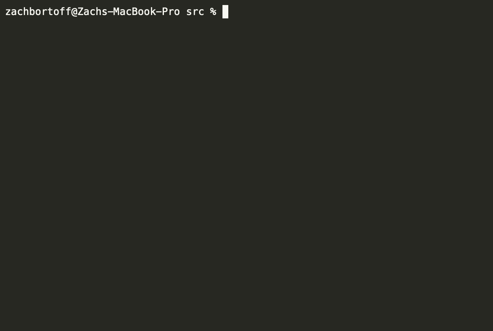

# Prometheus: Chess Engine
*
October 31, 2021
*

## Introduction
I go over how classical chess engines work, describe my own chess engine, [Prometheus](https://github.com/zborffs/Prometheus), and discuss the results of some experiments that guided me in the design thereof.

If you want to learn more about chess engines, I recommend checking out [this site](https://chessprogramming.org/). 

### Demo

